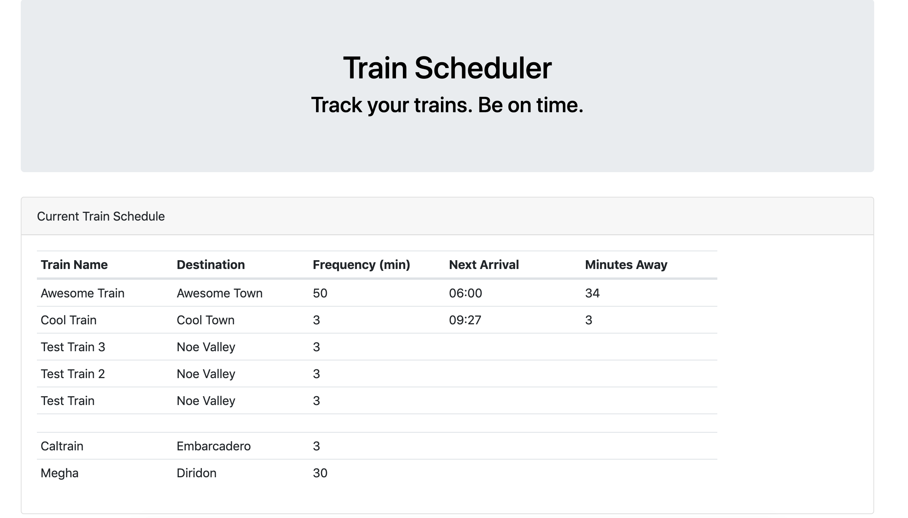

## Train Scheduler - Be on Time!

This is a web app that allows user to add trains to the scheduler with inputs such as train name, train station, First train time, and frequency of the train. In the scheduler they can track their train in real time. It calculates when the next train is and how many minutes away it is. The train is stored in Firebase, which allows user to store the data on the page and return to it at anytime!

## Site Image 

## Technologies Used 
1. Firebase
2. HTML/CSS
3. Bootstrap
4. Javacript
5. Jquery 

## Built by 
Megha Bindiganavale 

